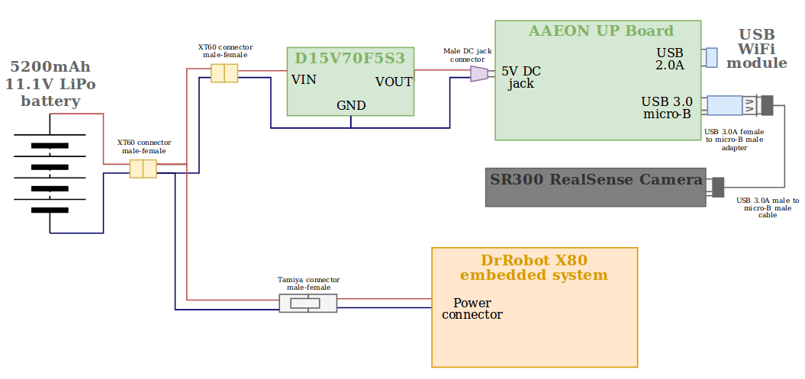

# Autonomous SLAM with ROS using the DrRobot X80 and an Intel RealSense Camera

This repository is dedicated to the development of a robotic system that performs [Simultaneous Localization And Mapping](https://github.com/A01371852/ROS_Autonomous_SLAM/projects/1) through ROS.

SLAM is concerned with the problem of building the map of an unknown environment with a mobile robot, while at the same time being able to localize itself within the navigated environment. The system is implemented using the DrRobot X80 platform as a starting point and an Intel Realsense RGB/Depth camera to retrieve visual information for the 3D mapping of closed room.

Navigation demo from 11/16/19: https://youtu.be/bn-o5vQM7YU

<p align="center">
  
</p>

## Tutorial

The following steps are aimed to help the user replicate the setting up of the project at its current state, as well as giving an overall understanding of the implemented system.

| NOTE: This tutorial serves as a guide to setup the project to run in ROS [Kinetic Kame](http://wiki.ros.org/kinetic) and Ubuntu 16.04. However, it is recommended that any new contributor makes the effort of migrating the current state of the project to the newest ROS distribution [Melodic Morenia](http://wiki.ros.org/melodic) and Ubuntu 18.04, as it will guarantee a longer support and the potential implementation of newer packages that might help push the project forward in the future. |
| --- |

### Prerequisites

#### Hardware prerequisites

* DrRobot X80 platform [[1](#bibliography)]
* Intel Realsense SR300 / BlasterX Senz3D camera [[2](#bibliography)]
* AAEON UP Board [[3](#bibliography)] (or a similar board with a USB 3.0 port and 64bit architecture)
* WiFi-USB module (only if the board does not have an embedded WiFi module already)
* TRENDnet N300 Wireless Router [[4](#bibliography)]
* 11.1V 3S LiPo battery with at least 3000mAh (5200mAh recommended)
* Pololu D15V70F5S3 5V step-down power regulator [[5](#bibliography)] or a regulator with similar specifications
* External PC with WiFi

#### Software prerequisites

* Ubuntu 16.04 Operating System for both the UP Board and the external PC

The process for installing Ubuntu 16.04 in both devices is the following:

* Download the ISO file from [this link](http://releases.ubuntu.com/16.04/) by selecting the `64-bit PC (AMD64) desktop image`.
* Create a bootable USB image of the ISO file. That process is explained in these links for [Windows](https://tutorials.ubuntu.com/tutorial/tutorial-create-a-usb-stick-on-windows#0) and [MacOS](https://tutorials.ubuntu.com/tutorial/tutorial-create-a-usb-stick-on-macos#0).
* Installing Ubuntu 16.04 in both computers as explained in [this tutorial](https://tutorials.ubuntu.com/tutorial/tutorial-install-ubuntu-desktop-1604#0).

Although a virtual machine with Ubuntu can be used in the external PC, is is recomended that Ubuntu runs natively in both computers. A recommended alternative to using a VM is [installing Ubuntu in a disk partition and using dual boot](https://www.tecmint.com/install-ubuntu-alongside-with-windows-dual-boot/).

### Setup

#### Hardware setup

Setting up the hardware is pretty straightforward. However, it is recommended to **check for any short circuit** between the terminals of the regulators before connecting the battery, and to **measure the output voltage** of the step-down regulator before connecting the UP Board.

After the security checks, the charged and balanced LiPo battery is connected to the DrRobot X80 using a male Tamiya connector, and to the 5V power regulator. The X80 can be connected directly to the battery as it already incorporates a low dropout regulator [[6](#bibliography)]. The UP Board will be fed 5V by the step-down regulator through a male DC jack connector. Finally, the camera is connected to the UP Board through the USB 3.0 port; an addapter for the cable might be needed as illustrated in this diagram.

<p align="center">
  
</p>

#### Software setup

A reliable internet connection is needed. The commands are run in a bash terminal (Ctrl+Alt+T).

##### Installing ROS

Once Ubuntu 16.04 has been installed in both the UP Board and the external PC, the next step is to install the ROS distribution Kinetic Kame. This section is based on the more in-depth tutorial from the ROS Wiki: [Ubuntu install of ROS Kinetic](http://wiki.ros.org/kinetic/Installation/Ubuntu). For a more detailed explanation please read the provided link. **These steps are executed in both computers**

Setup your computer to accept software from packages.ros.org by modifying the file `sources.list`:
```
$ sudo sh -c 'echo "deb http://packages.ros.org/ros/ubuntu $(lsb_release -sc) main" > /etc/apt/sources.list.d/ros-latest.list'
```
Setup the keys:
```
$ sudo apt-key adv --keyserver 'hkp://keyserver.ubuntu.com:80' --recv-key C1CF6E31E6BADE8868B172B4F42ED6FBAB17C654
```
Make sure your package index is up-to-date:
```
$ sudo apt-get update
```
Perform a ROS Kinetic Kame full installation:
```
$ sudo apt-get install ros-kinetic-desktop-full
```
Initialize rosdep:
```
$ sudo rosdep init
$ rosdep update
```
Setup your ROS environment variables to be automatically added to your bash session every time a new shell is launched:
```
$ echo "source /opt/ros/kinetic/setup.bash" >> ~/.bashrc
$ source ~/.bashrc
```
Install other dependencies for building ROS packages:
```
$ sudo apt install python-rosinstall python-rosinstall-generator python-wstool build-essential
```

Up to this point, the core tools for ROS have been setup in the computer.

##### Setting up the UP Board catkin workspace

This section is based on the ROS tutorial [Installing and Configuring Your ROS Environment](http://wiki.ros.org/ROS/Tutorials/InstallingandConfiguringROSEnvironment#Create_a_ROS_Workspace). 

Create and build a catkin workspace:
```
$ mkdir -p ~/catkin_ws/src
$ cd ~/catkin_ws/
$ catkin_make
```
Add `setup.bash` file to your bash session so that it is sourced every time a new shell is launched:
```
$ echo "source ~/catkin_ws/devel/setup.bash" >> ~/.bashrc
$ source ~/.bashrc
```

After this, what is left is installing the Intel RealSense libaries in the UP Board as explained in their repository [Install Intel RealSense ROS from Sources](https://github.com/IntelRealSense/realsense-ros#step-3-install-intel-realsense-ros-from-sources):


Clone the latest Intel RealSense ROS repository into your catkin workspace:
```
$ cd ~/catkin_ws/src/
$ git clone https://github.com/IntelRealSense/realsense-ros.git
$ cd realsense-ros/
$ git checkout `git tag | sort -V | grep -P "^\d+\.\d+\.\d+" | tail -1`
$ cd ..
```
Build the libary:
```
$ catkin_init_workspace
$ cd ..
$ catkin_make clean
$ catkin_make -DCATKIN_ENABLE_TESTING=False -DCMAKE_BUILD_TYPE=Release
$ catkin_make install
```

After this, the RealSense ROS package should be installed. Next we need to copy the custom launch file for the camera:

Clone **this** repository on a directory in your computer (i.e. `~/Documents`):
```
$ apt-get install git-core
$ cd ~/Documents/
$ git clone https://github.com/A01371852/ROS_Autonomous_SLAM.git
```
Copy the `sr300_throttle.launch` file into your `catkin_ws` directory:
```
$ cp ROS_Autonomous_SLAM/catkin_ws/sr300_throttle.launch ~/catkin_ws/
```

Then we can setup the external PC.


##### Setting up the External PC catkin workspace

The process for setting up the catkin workspace in the external is slightly different from the previous section.

Clone **this** repository on a directory in your computer (i.e. `~/Documents`):
```
$ apt-get install git-core
$ cd ~/Documents/
$ git clone https://github.com/A01371852/ROS_Autonomous_SLAM.git
```
Copy the `catkin_ws` directory into your root directory:
```
$ cp -r ./ROS_Autonomous_SLAM/catkin_ws/ ~/
```
Build your catkin workspace:
```
$ cd ~/catkin_ws/
$ catkin_make
```
Add `setup.bash` file to your bash session so that it is sourced every time a new shell is launched:
```
$ echo "source ~/catkin_ws/devel/setup.bash" >> ~/.bashrc
$ source ~/.bashrc
```

By now the catkin workspace of the external PC is set. However, an extra step might be needed to finish the setup since, on the date this tutorial was written, a component needed for this tutorial (`rtabmap_ros/rgbd_relay`) has not yet been released with the default RTAB-Map version. This issue might be solved in future RTAB-Map releases, but for now RTAB-Map needs to be [built from source](https://github.com/introlab/rtabmap_ros/tree/4646b99cbb5709f1dfb25f8b89784b265abf5dbe#build-from-source). For a more in-depth explanation about this process please visit the provided link. **This process might take a couple hours**, so keep it in mind.

Install RTAB-Map standalone libraries. *Clone is done in the root directory, not in your catkin_ws*:
```
$ cd ~
$ git clone https://github.com/introlab/rtabmap.git rtabmap
$ cd rtabmap/build
$ cmake ..  [<---double dots included]
$ make
$ sudo make install
```
Install RTAB-Map ros-pkg in your src folder of your Catkin workspace:
```
$ cd ~/catkin_ws
$ git clone https://github.com/introlab/rtabmap_ros.git src/rtabmap_ros
$ catkin_make -j1
```

RTAB-Map is now built. After this your external PC should be ready for the Network setup.

#### Network setup

This system is designed to run inside a Local Network (LAN) using a TRENDnet N300 Wireless Router. You might be able to use a different router, however it might involve changing the configuration of the X80 wireless module, which is not recommended as it might compromise the functioning of the robot.

For this tutorial the **router** labeled as **"X80/2"** was used. Other routers might have a different username or password, or even a different configuration. Also, the **robot** that was used is labeled as **"X80/3"** with the static IP 192.168.0.203. The IP of the robot by default is printed underneath the chassis.

##### Setting up the DHCP list

From a computer with WiFi, connect to the newtwork with the following configuration:

* SSID: *dri*
* Password: *112233445566778899AABBCCDD*

To change the router configuration access this IP from a web browser: http://192.168.0.200/ and then enter the username and password:

* Username: *admin*
* Password: *drrobot*

Click on *Main* and look for the DHCP List. To avoid further difficulties it is recommended to set static IPs for the two computers to be used. In the *Dynamic DHCP List* you might see your computer's name, IP and MAC addresses. Copy them on the text-boxes above and click *Add* to make them static. The same information may now be displayed in the *Static DHCP List*. You may now connect the other computer to the same network and add it to the static list as well.

##### Connecting the X80

If everything is working properly the DrRobot X80 will automatically connect to the *dri* network, as it is configured to do so by default. You can verify this by doing a ping test:
```
$ ping 192.168.0.203
```
If the output is similar to this, then the robot was successfully connected to the LAN:
```
64 bytes from 192.168.0.203: icmp_seq=1 ttl=64 time=6.59 ms
```
If, however, the output is similar to this, there is a problem with the WiFi module of the robot or the router is not configured properly:
```
From 192.168.0.101 icmp_seq=10 Destination Host Unreachable
```
The console will continue on printing messages indefinitely, so you can kill the proccess with Ctrl+C anytime.

##### Setting up your ROS environment variables

As explained in the ROS [Network Setup tutorial](http://wiki.ros.org/ROS/NetworkSetup#Single_machine_configuration), the environment variables `ROS_HOSTNAME` and `ROS_IP` have to be configured in all the computers within the LAN.

For this example lets assume that the IP of the UP Board is `192.168.0.103` and the IP of the external PC is `192.168.0.101`. The following commands have to be executed in the UP Board:

```
$ echo "export ROS_MASTER_URI=http://192.168.0.103:11311/" >> ~/.bashrc
$ echo "export ROS_IP=192.168.0.103" >> ~/.bashrc
$ source ~/.bashrc
```
And these commands are executed in the external PC:

```
$ echo "export ROS_MASTER_URI=http://192.168.0.103:11311/" >> ~/.bashrc
$ echo "export ROS_IP=192.168.0.101" >> ~/.bashrc
$ source ~/.bashrc
```

Notice that the `ROS_MASTER_URI` variable is the same for all the computers. This implies that the UP Board will always run the master node. To make sure the variables have been set verify the output of these commands:

```
$ echo $ROS_IP
$ echo $ROS_MASTER_URI
```

##### Solving timing issues

A common issue when doing remote mapping with RTAB-Map/RViz is the program complaining about extrapolation into the future or past, which in broad terms means that there exists a discrepancy in the system clocks for the machines across the network. As explained in the [Network Setup tutorial](http://wiki.ros.org/ROS/NetworkSetup#Timing_issues.2C_TF_complaining_about_extrapolation_into_the_future.3F) a solution is to use `ntpdate` to reduce this discrepancy:

Install ntpdate in both computers:
```
$ sudo apt-get install ntpdate
```
Synchronize both system clocks. This is done only **in one of the two computers**. In this example we are running these commands in the UP Board to synchronize its clock with that of the external PC:
```
$ echo "/etc/init.d/chrony stop" >> ~/.bashrc
$ echo "sudo ntpdate -u 192.168.0.101" >> ~/.bashrc
$ echo "/etc/init.d/chrony start" >> ~/.bashrc
$ source ~/.bashrc
```
Now these commands will execute every time you open a new terminal on the UP Board. If the clocks are already synchronized whenever you open a new terminal you can skip it by pressing Ctrl+C. To verify that the process was sucessful this command should output a low discrepancy (less than 0.1 seg):
```
$ ntpdate -q 192.168.0.101
```
After this, everything should be set to run the demo.

### Run the demo


## Authors

* **Marcos Eduardo Castañeda Guzman** (A01372581@itesm.mx) - *Digital Systems and Robotics Engineering*
* **Gerardo Uriel Monroy Vázquez** (A01372286@itesm.mx) - *Digital Systems and Robotics Engineering*
* **Emmanuel Hernández Olvera** (A01371852@itesm.mx) - *Digital Systems and Robotics Engineering*

## Bibliography

1. Dr.Robot. (2006). *WiRobot X80 USER MANUAL*. Retrieved from: [https://www.cs.princeton.edu/courses/archive/fall11/cos495/X80_Manual.pdf](Datasheets/X80_Manual.pdf)
2. Intel Corporation. (2016). *Intel RealSense Camera SR300*. Retrieved from: [https://www.mouser.com/pdfdocs/intel_realsense_camera_sr300.pdf](Datasheets/intel_realsense_camera_sr300.pdf)
3. AAEON. (2019). *UP Datasheet V8.5*. Retrieved from: [http://data-us.aaeon.com/DOWNLOAD/2014%20datasheet/Boards/UPDatasheetV8.5.pdf](Datasheets/AAEON_UP_Board.pdf)
4. TRENDnet. (2012). *N300 Wireless Home Router*. Retrieved from: [https://www.trendnet.com/support/support-detail.asp?prod=230_TEW-731BR](Datasheets/Router_TEW-731BR(1.01).pdf)
5. PololuCorporation. (2019). *Pololu Step-Down Voltage Regulator D15V70F5S3*. Retrieved from: [https://www.pololu.com/product/2111/specs](Datasheets/Pololu_D15V70F5S3%E2%80%8B%E2%80%8B.pdf)
6. Texas Instruments. (2014). LM2940x 1-A Low Dropout Regulator. Retrieved from: [http://www.ti.com/lit/ds/symlink/lm2940-n.pdf](Datasheets/LM2940T-5.0-NOPB.pdf)
